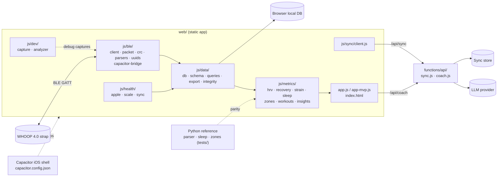

# Architecture

A browser-based WHOOP 4.0 client (Web Bluetooth, optionally wrapped with Capacitor on iOS). Data is stored locally in the browser; two small Cloudflare-style functions handle optional sync and coaching.

